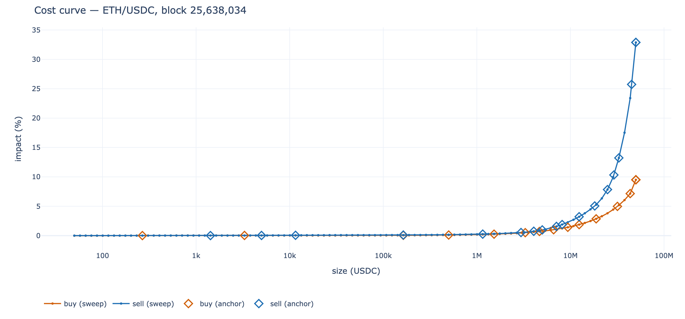
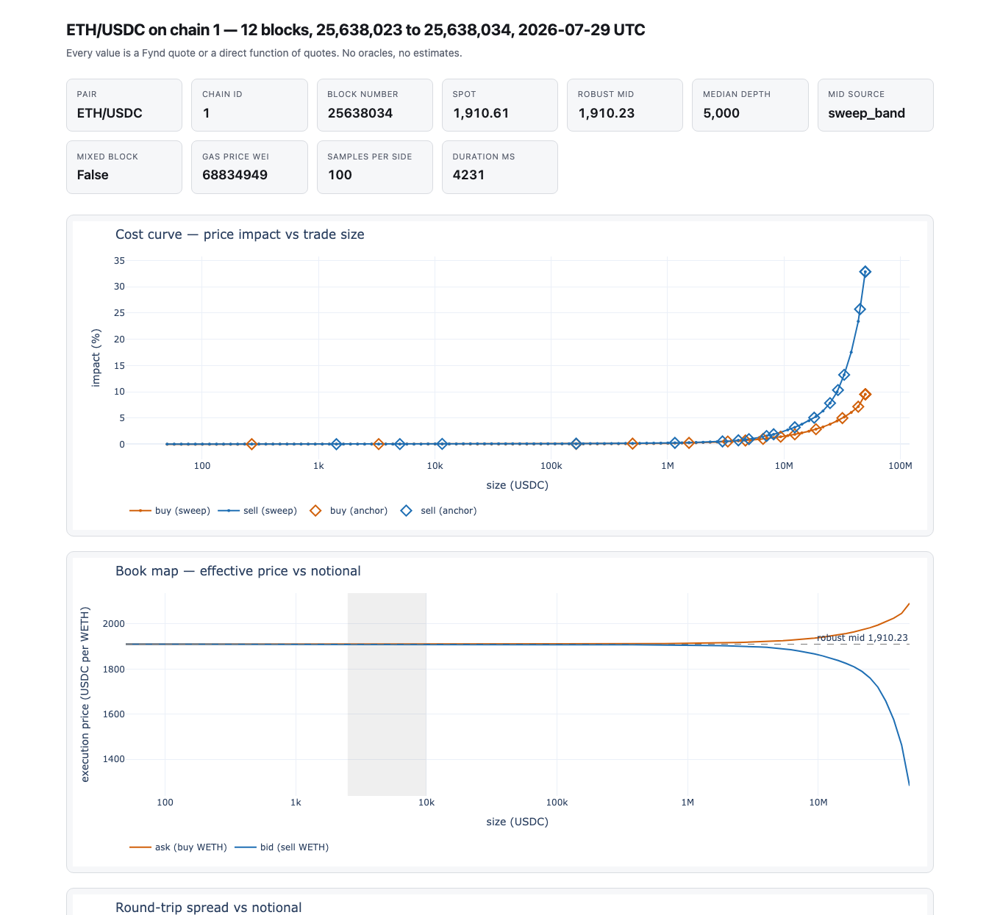

# Price Of Ethereum

What does it actually cost to trade a token pair onchain, right now, at size?
This measures it — block by block, from your own [Fynd](https://docs.fynd.xyz)
instance, for any pair on any chain Fynd supports. Every number is a Fynd quote
or a simple function of quotes. No oracles and no price estimates; the one
hosted dependency is Tycho, which resolves a token's decimals, symbol, quality
and tax before measuring (Fynd needs a Tycho API key regardless, to index the
liquidity it quotes against). Pass `--token-decimals`, `--token-symbol`,
`--numeraire-decimals` and `--numeraire-symbol` to skip even that lookup.

> Status: verified against Ethereum mainnet. Treat the API as unstable until 1.0.

## Why

A single "price" says nothing about what you can trade. The price to move $1,000
and the price to move $5,000,000 differ by orders of magnitude, and both change
every block as liquidity moves.

So instead of quoting one number, this sweeps ~100 trade sizes per side across a
single block and records what the router actually returns at each one: execution
price, price impact, the pools routed through, and gas. The result is the shape
of the market — a cost curve and a two-sided book — rather than a point estimate,
and it arrives as a tidy DataFrame you can check yourself.

## What it looks like

[](./examples/quickstart.ipynb)

[`examples/quickstart.ipynb`](./examples/quickstart.ipynb) reads on GitHub with
its charts already drawn: every figure carries a static image beside the
interactive one, because GitHub's notebook viewer runs no JavaScript and a
Plotly figure alone would be a blank gap there.

[](./examples/report.html)

[`examples/report.html`](./examples/report.html) is what `poe report` writes —
one self-contained file with Plotly inlined and nothing loaded off-machine.
GitHub serves a committed `.html` as source rather than rendering it, so seeing
the real thing means downloading that file and opening it; the image above is a
screenshot of exactly that.

**Both are real measurements, and both record which one.** The report and the
chart above come from [`examples/data`](./examples/data) — ETH/USDC on Ethereum
mainnet, 12 blocks, 25,632,157–25,632,168, recorded 2026-07-28 — a dataset
committed beside them, with a note stating exactly what was measured and when.
The report is rendered from those three files and nothing else, so
`poe report --out examples/data` rebuilds it with no Fynd, no key and no network;
the committed copy differs only in carrying its block range in the title. The
notebook's stored outputs are a separate live run against the same mainnet Fynd,
a few blocks later, and it prints its own range in section 6.

Read all of it as a specimen rather than as a price. Liquidity moves every
block, and this is a few minutes of one afternoon.

## Install

This package is not distributed on a package index; install it from the
repository. [uv](https://docs.astral.sh/uv/) is what this project is built and
tested with, and `uv tool install` puts the `poe` command on your PATH in its
own environment:

```bash
uv tool install "git+https://github.com/propeller-heads/price-of-ethereum"
uv tool install "price-of-ethereum[viz] @ git+https://github.com/propeller-heads/price-of-ethereum"
```

To use it as a library from your own project, add it there instead:

```bash
uv add "git+https://github.com/propeller-heads/price-of-ethereum"
```

Nothing is tagged yet, so there is no released version to pin to; append
`@<commit>` if you need to fix one.

Measuring needs nothing heavy — the base install is `httpx` and `pydantic`, and
`poe snapshot` and `poe collect` run on it. The extras are additive:

| Extra | Adds | Needed for |
| --- | --- | --- |
| `data` | pandas | reading recorded JSONL back as a DataFrame |
| `viz` | pandas, Plotly | `poe report` and the notebook |
| `parquet` | pandas, pyarrow | `to_parquet` / `load_parquet` |

`parquet` is separate because pyarrow is a ~123 MB install, which is a lot to
impose on someone who only wants a chart.

### Without uv

Nothing here requires uv — it is a convenience, never a runtime dependency. The
same installs with pip:

```bash
pip install "git+https://github.com/propeller-heads/price-of-ethereum"
pip install "price-of-ethereum[viz] @ git+https://github.com/propeller-heads/price-of-ethereum"
```

One caveat that only bites pip: installing reaches the network even from a
checkout already on disk, because the build backend (`uv_build`) is fetched into
pip's build isolation before any dependency is considered, so `--no-index` fails
there first. On a machine without an index that carries it, install the backend
once and then build without isolation:

```bash
pip install uv_build                       # once, from your mirror
source .venv/bin/activate                  # required: the backend is found on PATH
pip install . --no-build-isolation --no-index --no-deps
```

## Setup

The SDK measures against a [Fynd](https://docs.fynd.xyz) server you run
yourself. Five steps, start to finish.

**1. Get a Tycho API key.** Message the Telegram bot
[@fynd_portal_bot](https://t.me/fynd_portal_bot): run `/start` and follow the
prompts. The key is required, not optional — Fynd uses it to index the liquidity
it quotes against — and it is free during beta. The
[Fynd quickstart](https://docs.fynd.xyz/get-started/quickstart), the
[key instructions](https://docs.fynd.xyz/get-started/hosted-api#get-an-api-key)
and the [Tycho docs](https://docs.propellerheads.xyz/tycho) all point at that
same bot.

**2. Install Fynd.**

```bash
cargo install fynd
```

**3. Write the worker-pool config.**

```bash
poe init-worker-pools     # writes ./worker_pools.toml (--out to change the path)
```

Fynd's `-w` / `--worker-pools-config` defaults to `worker_pools.toml` in the
working directory, so starting Fynd from the same directory picks this file up
with no flag. It configures three of Fynd's four documented solver algorithms:
`bellman_ford` (the single-path baseline the bulk sweep waits on), plus
`path_frank_wolfe` and `water_fill` for the split routes the anchored levels
wait on. See
[server configuration](https://docs.fynd.xyz/guides/server-configuration) for
every knob; the file itself explains why each value was chosen.

**4. Start Fynd.**

```bash
export TYCHO_API_KEY=<your-key>
export RUST_LOG=fynd=info
fynd serve                          # add -w /path/to/worker_pools.toml if it is elsewhere
```

Or with Docker — port 3000 is the API, 9898 the Prometheus metrics endpoint:

```bash
docker run -e TYCHO_API_KEY=<your-key> -e RUST_LOG=fynd=info \
  -p 3000:3000 -p 9898:9898 \
  -v "$PWD/worker_pools.toml:/worker_pools.toml" \
  ghcr.io/propeller-heads/fynd serve -w /worker_pools.toml
```

**5. Wait for hydration, then measure.** Cold start takes ~1–5 min while Fynd
loads protocol state. Check it directly:

```bash
curl http://localhost:3000/v1/health
```

`wait_until_ready()` polls that same endpoint, and `poe snapshot` and
`poe collect` both call it before measuring, so you can simply start them and
wait.

### Chains

`fynd serve --chain` defaults to `ethereum` and also accepts `base`, `unichain`,
`bsc`, `arbitrum` and `polygon` — see the
[server configuration docs](https://docs.fynd.xyz/guides/server-configuration)
for the current list.

This SDK ships a hosted Tycho endpoint for all six, so selecting a chain is one
flag on Fynd and nothing here:

| `fynd serve --chain` | chain id | Tycho host                                    |
| -------------------- | -------- | --------------------------------------------- |
| `ethereum`           | 1        | `tycho-beta.propellerheads.xyz`               |
| `bsc`                | 56       | `tycho-bsc-beta.propellerheads.xyz`           |
| `unichain`           | 130      | `tycho-unichain-beta.propellerheads.xyz`      |
| `polygon`            | 137      | `tycho-polygon-beta.propellerheads.xyz`       |
| `base`               | 8453     | `tycho-base-beta.propellerheads.xyz`          |
| `arbitrum`           | 42161    | `tycho-arbitrum-beta.propellerheads.xyz`      |

`poe` reads the chain id from Fynd's `/v1/info` and picks the matching host, so
you never pass it twice. **Only Ethereum mainnet has been verified end to end
against live liquidity.** The other five are wired up but untested — the host
answers, and nothing beyond that has been checked.

#### Fast chains break the single-block premise

A snapshot is one measurement of one block: roughly 220 quotes that all have to
land before the chain moves on, which is what the bundled worker-pool config is
tuned for. That tuning was measured on Ethereum, where a snapshot takes 2.5–3.0 s
against a ~12 s block, and the margin is comfortable.

Every other chain Fynd routes on has shorter blocks — published figures run from
about 2 s on `base` down to roughly 250 ms on `arbitrum` — while snapshot
duration depends on how much liquidity that chain's graph holds, so it is not
the same 2.5–3.0 s everywhere. Whether a snapshot fits is therefore an empirical
question per chain, and this SDK answers it from its own output rather than from
a table:

- `duration_ms` in each block summary is how long that snapshot took.
- Consecutive `block_timestamp` values give the chain's real block interval, so
  you never have to trust a documented figure.
- `mixed_block` says outright whether the snapshot straddled a boundary.

Straddling is not silent: `mixed_block` goes true, quotes from the minority block
are dropped from the rows, and the majority block labels the snapshot. You get an
honest measurement of a moving target rather than a clean one of a single state.

There is a second, separate way to lose a block, and it is not about sweep
length. Between snapshots the collector asks Fynd whether the block has moved,
and sleeps `--poll-interval-s` between asks. Sleep longer than a block and one
passes unnoticed — no quote ever touches it. The default is per chain because
the useful range is bounded at both ends: Fynd reports a block number only
inside a quote, so every poll is a route solve costing roughly 13ms on a thin
graph and 114ms on a fat one, while a poll interval near the block time spends
the window the sweep needs. Chains this SDK knows are set between those bounds;
anything else gets a conservative default. `--poll-interval-s` overrides it, and
`solve_time_ms` in the rows tells you what the floor is for your pair.

Whether that matters depends on what you are asking. A cost curve over a second
of a fast chain is still a real cost curve; it is just not the instantaneous
snapshot the design promises. If you need `mixed_block` false there, you have to
make the snapshot shorter than a block, which means fewer quotes and a faster
solve — lower `--samples-per-side`, raise `--max-workers` if your Fynd has the
cores, and cut the per-pool `timeout_ms` in `worker_pools.toml` (`poe
init-worker-pools` writes it, and its comments record what each value was
measured to do). Note that `--samples-per-side` is part of how `robust_mid` is
defined, not a free resolution knob, so lowering it changes the number you get.

On sub-second chains no tuning closes the gap. Treat `mixed_block` as the honest
label it is, and read `duration_ms` against your chain's block time to see how
far off you are.

`--tycho-url` overrides the host for the chain Fynd reports, pointing at a
self-hosted or otherwise different Tycho. It belongs to the subcommand, not to
`poe` itself — `poe snapshot --tycho-url …`, not `poe --tycho-url … snapshot`.
To skip Tycho altogether — on a chain not in this table, or with no key at all
— pass `--token-decimals`, `--token-symbol`, `--numeraire-decimals` and
`--numeraire-symbol` and `poe` measures against your local Fynd alone.

## Quickstart

```bash
export TYCHO_API_KEY=<your-key>

poe snapshot                       # measure one block, print its summary
poe collect --blocks 50 --out data # record 50 blocks into JSONL
poe report --out data --output report.html   # self-contained HTML report
```

A snapshot is roughly 220 quotes against your Fynd: 100 sizes per side, plus the
anchored levels and a handful of probes. That has to fit inside one block, which
is what the bundled worker-pool config is tuned for — 2.5-3.0 s per snapshot on
mainnet. `collect` then waits for the next block, so wall-clock is set by the
chain rather than by this tool: 50 blocks on Ethereum is about ten minutes and
some 11,000 quotes, all against a server you are running.

`poe snapshot --help` lists the measurement knobs (`--pair`, `--token`,
`--numeraire`, `--samples-per-side`, `--search-min/max`). `report` reads only
what is already on disk — it never contacts Fynd or Tycho. Fynd's HTTP surface,
if you want to call it directly, is documented in the
[API reference](https://docs.fynd.xyz/reference/api).

As a library:

```python
import os

from price_of_ethereum import (
    FyndClient, SnapshotConfig, TychoClient, collect_snapshot, resolve_tokens,
)

WETH = "0xC02aaA39b223FE8D0A0e5C4F27eAD9083C756Cc2"
USDC = "0xA0b86991c6218b36c1d19D4a2e9Eb0cE3606eB48"

fynd = FyndClient("http://127.0.0.1:3000")
fynd.wait_until_ready()
tycho = TychoClient("https://tycho-beta.propellerheads.xyz", os.environ["TYCHO_API_KEY"])
tokens = resolve_tokens(tycho, [WETH, USDC])

snapshot = collect_snapshot(fynd, SnapshotConfig(
    token=tokens[WETH.lower()],
    numeraire=tokens[USDC.lower()],
    pair="ETH/USDC",
    chain_id=fynd.info().chain_id,
))
print(snapshot.robust_mid, snapshot.median_depth, snapshot.mid_source)
rows = snapshot.to_rows()   # one dict per measured rung, curve + anchor
```

## What you get per block

`spot` from a single $1,000 probe; `robust_mid` as the median of two-sided
midpoints in the $2,500–$10,000 numeraire band (with dedicated-probe and
spot fallbacks, reported in `mid_source`); a log-spaced cost curve on both
sides; anchored measurements at the headline impact levels, solved waiting for
every solver pool so split routes are captured; and per-rung route metadata.
Block identity comes from the quotes themselves — the majority block labels the
snapshot and `mixed_block` flags a straddle. There is no RPC client and no
database anywhere in this package.

Those dollar figures are the point of `--usd-reference`. The band, the spot
probe and the grid bounds are all denominated in the numeraire, and only read as
dollars when the numeraire is a dollar. Measuring ETH in USDC they are the same
thing; measuring BTC in BNB, a "2,500" band would mean 2,500 BNB — millions of
dollars, far outside any sweep — and `robust_mid` would fall back every block.

So `poe` prices the numeraire against a stablecoin on the chain Fynd reports and
scales those defaults into numeraire units. It quotes both ways — buying the
numeraire with the reference and selling it back — and takes the midpoint, so
the rate is not the ask that one direction would give. The round trip is also
the check on itself: a pair that costs more than 2% to cross cannot price
anything, and rather than scale by a number that is mostly its own impact, the
run keeps raw numeraire units and says so.

The rate lands in each block summary as `numeraire_usd`, alongside the
`mid_band_min`/`mid_band_max` it produced, so a reader can see what the band
meant. It is measured once per run, because a band that moved between blocks
would make them incomparable, and `numeraire_usd_block` records the block it was
measured at so its age on a later row is visible rather than assumed.

Pass `--usd-reference <address>` to choose a different reference,
`--usd-reference-decimals` to skip the Tycho lookup for it, or `--usd-reference
none` to keep every size in raw numeraire units. When there is no route to the
reference, `numeraire_usd` is null and sizes stay in numeraire units — recorded
rather than guessed. Setting `--search-min`/`--search-max` yourself always wins
over the scaling.

Each anchored level also writes the transaction behind it to `*.anchors.jsonl`:
the router address, the calldata, the fee breakdown, and a Tenderly simulation
link — the proof that a measurement corresponds to a trade someone could send.
Quotes are encoded for `--sender`, which defaults to a placeholder address that
holds nothing, so those links open but revert on the transfer and are recorded
as `tenderly_status="placeholder_sender"`. Pass an address that actually holds
the sell token and has approved the router to get `ready` links that simulate.

Encoding can also fail on its own terms. `--slippage` sets the bound the
calldata is built for, and its 0.1% default is tight enough that Fynd's price
guard refuses the largest sizes on a deep pair. Those levels are still measured
— the price is re-quoted without encoding and recorded with
`tenderly_status="no_transaction"` — so raising the bound buys you proof for the
top of the curve, not the numbers themselves. The value is stored in each block
summary, since calldata only means anything against the bound it was built for.

## What lands on disk

`poe collect --out data` writes three JSONL files per pair and chain, named from
the pair label and chain id — `ETH/USDC` on chain 1 becomes:

```
data/eth-usdc_1.rows.jsonl      one line per measured trade size
data/eth-usdc_1.blocks.jsonl    one line per block
data/eth-usdc_1.anchors.jsonl   one line per anchored level
```

Rows and anchors are written before the block summary, so a block present in
`blocks.jsonl` has all of its rows on disk — join the others against it and a
run killed mid-block costs you that block, not the file.

**`rows.jsonl`** — `kind` is `curve` for a swept rung and `anchor` for a headline
level:

| | |
| --- | --- |
| identity | `kind`, `chain_id`, `block_number`, `block_hash`, `block_timestamp`, `pair`, `side`, `mixed_block` |
| the trade | `size_numeraire`, `amount_in`, `amount_out`, `amount_out_net_gas` |
| the result | `execution_price`, `impact_pct`, `price_impact_bps`, `price_impact_bps_raw` |
| gas | `gas_estimate`, `gas_price`, `gas_cost_token_out` |
| route | `route_hash`, `n_pools`, `protocols`, `solve_time_ms` |
| token | `token_quality`, `token_tax` |

`kind="anchor"` rows carry four more: `target_impact_pct`, `bound`,
`target_reached` and `derived_from` — the last says whether the level came from
a dedicated bisection or was read off the sweep.

**`blocks.jsonl`** — `pair`, `chain_id`, `token_symbol`, `numeraire_symbol`,
`block_number`, `block_hash`, `block_timestamp`, `mixed_block`, `spot`,
`robust_mid`, `median_depth`, `mid_source`, `gas_price_wei`, `search_min`,
`search_max`, `samples_per_side`, `mid_band_min`, `mid_band_max`,
`numeraire_usd`, `numeraire_usd_block`, `slippage`, `duration_ms`.

**`anchors.jsonl`** — the executable proof: `order_id`, `transaction_to`,
`transaction_value`, `transaction_data`, `router_fee`, `client_fee`,
`max_slippage`, `min_amount_received`, `tenderly_url`, `tenderly_status`, keyed
by the same block identity plus `side`, `target_impact_pct` and `size_numeraire`.

Sizes are in whole numeraire units; amounts are base-unit strings as the chain
reports them; `price_impact_bps` is basis points and `impact_pct` is percent.

## Report

`poe report` renders the recorded JSONL into one HTML file: cost curve, book map
with the robust-mid band shaded, round-trip spread as a percent of the mid, the
anchored levels as a table, and mid/depth/latency across every recorded block.
Axes carry the real token symbols, and prices read numeraire per token
throughout. Plotly ships inside the `viz` extra and its bundle is inlined, so
the file is ~5 MB, opens straight from disk, and requests nothing off-machine.

The report is a snapshot of the file at the moment you ran it. To watch a
running collection, re-run `poe report` and reopen the file — or, if you want it
over HTTP, serve the directory:

```bash
poe collect --out data &
poe report --out data --output report.html
python -m http.server --directory .    # optional; the file works fine without it
```

The JSONL the collector writes is the full raw dataset, so nothing in the report
is the only copy of anything.

[`examples/report.html`](./examples/report.html) is a committed one, rendered
from the dataset in [`examples/data`](./examples/data). Download it to open it —
GitHub shows a committed `.html` as source, and `raw.githubusercontent.com`
serves it as `text/plain`, so neither renders the page.

## Notebook

[`examples/quickstart.ipynb`](./examples/quickstart.ipynb) walks the whole path:
connect, one snapshot, what a measurement contains, the charts, where the route
changes and impact stops being monotonic, and recording a history. It calls the
same figure builders `poe report` does, so it draws exactly what the report
draws — use the notebook to explore interactively, the report to share a result.

```bash
pip install jupyterlab            # alongside the viz extra above
jupyter lab examples/quickstart.ipynb
```

The outputs committed to it are a real ETH/USDC measurement; section 6 prints
the chain and block range they came from, and running the notebook replaces them
with yours.

With no Fynd listening it runs anyway, on
[`examples/simulated_fynd.py`](./examples/simulated_fynd.py) — a fabricated
two-pool AMM that answers through `httpx.MockTransport`, so the sweep, the
bisection and the collector all run unchanged with nothing installed beyond this
package and nothing listening on any port. It announces itself in the output and
names its pair `simETH/simUSDC` on chain 31337, so a fabricated run can never be
mistaken for a measured one.

## Development

See [CONTRIBUTING.md](./CONTRIBUTING.md) for dev setup, checks, and commit
conventions. With uv (recommended):

```bash
uv sync --all-extras --dev
uv run ruff check
uv run ruff format --check
uv run ty check
uv run pytest
```

Or with plain pip — uv, ruff, and ty are development conveniences, never runtime
requirements:

```bash
python -m venv .venv && source .venv/bin/activate
pip install -e ".[data,viz,parquet]" --group dev   # pip >= 25.1; or: pip install -e . pytest
pytest
```

All three extras, because the suite covers parquet conversion too; omitting
`parquet` leaves one test failing on a clean checkout. Activate the virtualenv
rather than calling `.venv/bin/…` directly — `ty` resolves imports from the
active environment and otherwise reports every third-party import as missing.

`uv.lock` pins the exact tool versions CI uses, and pip installs the floors from
`[dependency-groups]` instead. Those are pinned to the same versions for that
reason: a newer `ruff` can reformat files this one leaves alone, which shows up
as `ruff format --check` failing on a file you never touched.

## License

MIT — see [LICENSE](./LICENSE).
